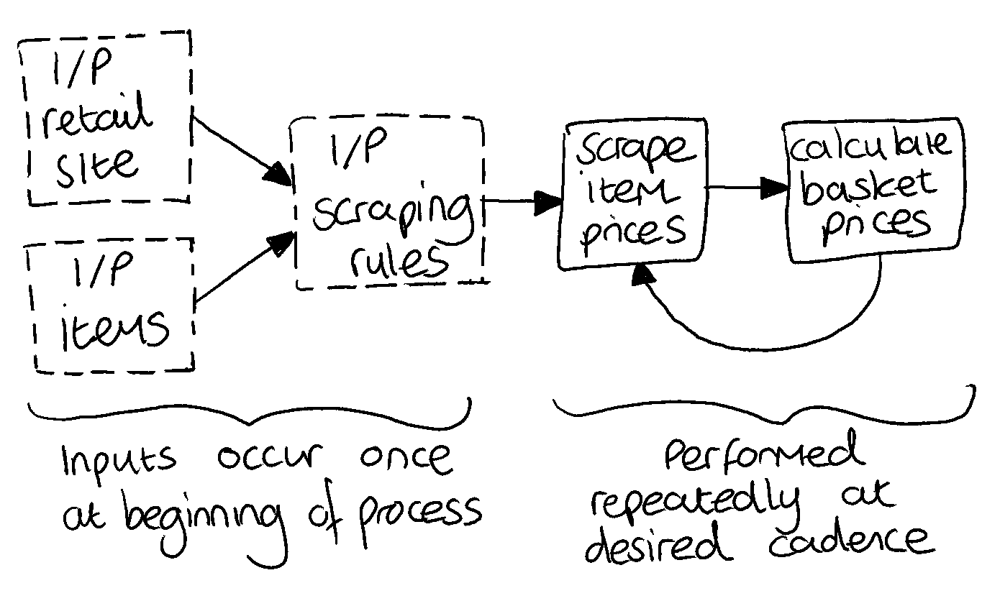
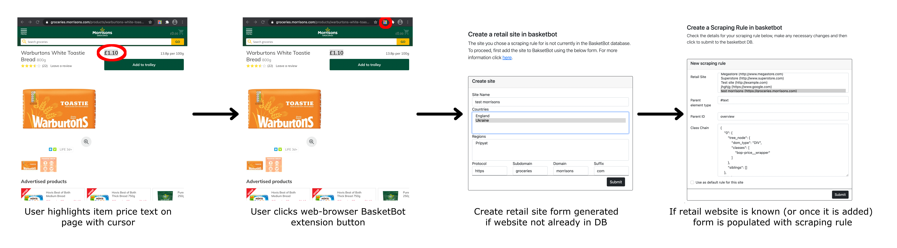

.. _overview:

Project overview
================

Problem outline
----------------

To work out a CPI-like measure for a given geographic locale, we need to find out the prices of a number of items (a 'basket') in that locale. This can be achieved in an automated fashion by scraping the costs of these items from websites of on-line retailers in the locale. The scraped data can then be combined to generate a 'basket-price' for a locale. If this automating collection and analysis of item prices is performed on a regular cadence then a history of prices can be displayed to a user, along with the most up-to-date basket-costs.

In principle, building an application to solve this problem may seem relatively simple, using a workflow something like the below diagram.

In this naive approach, a retail site, and associated items, along with a scraping rule detailing how to find the price of a given item the retail site are all specified *only once* at the outset of the process. As a kind of configuration. The ongoing work of the app is then to use this information at some regular interval to scrape item prices, calculate basket prices and display the results to a user in a GUI.

Unfortunately this workflow is extremely brittle. Websites are dynamic entities, and the following changes to a retail site would break this process entirely:

- Underlying HTML structure of an items web page changes, invalidating its scraping rule. 
- Item is removed from retail site (requiring an alternative item to be sourced).
- Location of an items page on the retail site (item URL) is changed.

Any of these changes are entirely possible in the expected development of a website, and as more retail sites and items are dealt with by the BasketBot application, the likelihood of such a change occuring, and the consequent breaking of the application, becomes large. Therefore all elements of the naive workflow shown above need to be maintained at a regular maintenance, and consequently **automatically maintaining and adapting a set of scraping rules is the most significant challenge of building a BasketBot app**. So much so, that most architectural decisions for the app need to be made with this issue of maintainability in mind. It is both unreasonable and undesirable to rely on BasketBot developers and maintainers to dive into the source code and perform complex tweaks to scraping rule syntax based on retail website changes. Ideally BasketBot should be clever enough to make these changes itself. At the very least it should provide a non-technical interface for users to make the necessary updates.

The rest of this overiew outlines a minimal-maintenance focused approach to describing, storing and updating scraping rules in BasketBot. The overview tries to remain somewhat abstract. For more implementation details of these ideas see :ref:`architecture`.

Scraping rule specification
---------------------------

The following algorithm is used to generate a scraping rule from a known location in a pages DOM where we know an item price to be located:

1. Start at location of item price text in the DOM
2. Move to the parent element in the DOM.
3. Record the element-type and class-names of the parent element
4. Record the element-types and class-names of all siblings to the parent element.
5. Repeat steps 3 and 4 until a DOM element is reached which has an ``id`` value.
6. Record the element-type and ``id`` of this element.

This procedure generates a tree of DOM-elements, which can be retraced from beginning at a uniquely identifiable location in the DOM (the final element found in steps 5 and 6, which is uniquely identifiable by its ``id``) down to the location containing the required item price string.

Consequently, a scraping rule of this form can be described with three components:

- ``parent_elem`` - then element-type (eg: ``DIV``, ``SECTION``, etc...) of the highest parent DOM element reached in the algorithm (the first element with an ``id``).
- ``parent_id`` - the HTML ``id`` of the highest parent DOM element reached in the algorithm.
- ``class-chain`` - a JSON-like structure outlining the tree of DOM elements traversed (including siblings at each stage) to reach the target item price from the highest parent element. 

Note that we also keep track of sibling elements at each stage in traversing the DOM as these can be helpful in validating the structure of the site during scraping, and also are potentially useful in more robust scraping approaches that we outline in :ref:`scraping-rule-maintenance`.

For example, consider the HTML shown below, from which we would want to generate a scraping rule to allow us to locate the ``£1.10`` price in future:

.. code:: html

    <section class="layout_section product_section site-width" id="main-content">
        <main class="product-detail-page layout_main">
            

                <button data-a="btnBack" type="button" class="btn btn-primary-outline" data-b="764849476">Back</button>
            

            

                <strong aria-label="Now £1.10" class="product_price details-price">
                    £1.10
                </strong>
            

        </main>
    </section>
			
Applying the algorithm described above, we would generate a scraping rule with the following components:

.. code:: python

    parent_elem = "section"
    parent_id = "main-content"
    class_chain = {
            "0": {
                "tree_node": {
                    "dom_type": "MAIN",
                    "classes": [
                        "product-detail-page",
                        "layout_main"
                        ]
                    },
                "siblings": []
                }
            "1": {
                "tree_node": {
                    "dom_type": "DIV",
                    "classes": [
                        "product-detail"
                        ]
                    },
                "siblings": [
                    {
                        "dom_type": "DIV",
                        "classes": [
                            "product-detail-page_breadcrumb-containter"
                            ]
                        }
                    ]
                }
            "2": {
                "tree_node": {
                    "dom_type": "STRONG",
                    "classes": [
                        "product_price",
                        "details-price"
                        ]
                    },
                "siblings": []
                }
            }

Here we've introduced the term ``"tree_node"`` to refer to the DOM element that is a direct parent of the desired item cost (as opposed to its ``"siblings"``), and ``"dom_type"`` to refer to the DOM element type of either a ``tree_node`` or ``sibling``.

There are several advantages to this particular specification for how a scraping rule is represented:

- Easy to serialize (transport and store as JSON).
- Easy to search (eg: postgresql JSONB columns).
- Easy to generate (see :ref:`scraping-rule-generation`).
- Easy to maintain (see :ref:`scraping-rule-maintenance`).
- Relatively efficient (eg: more efficient than storing the whole DOM of a page).
- Easily employed by scraping libraries (such as BeautifulSoup).

 .. _scraping-rule-generation:

Scraping rule generation
------------------------

Having established a spec for how to describe scraping rules for a given item on a given retail website, how do we generate these rules (i.e. how do we figure out what ``parent_elem``, ``parent_id`` and ``class_chain`` should be)?

The goal for scraping rule generation is to design a process that is both efficient and also does not require specialist knowledge of HTML or web-development. Our suggested mechanism is to use a web-browser extension to generate and submit scraping rules to BasketBot as outlined below:

As shown, the user navigates to the URL for an item, highlights the text on the page with the items price, and then click a button on the browser. This opens a page with a webform (requested from the BasketBot app server). If the retail website being scraped is not already know to the BasketBot DB then a form is presented for adding the retail site. After this is submitted, a form for submitting the scraping rule is loaded - pre-populated with the ``parent_elem``, ``parent_id`` and ``class_chain`` information required to scrape the highlighted price text. The user can then edit this information if necessary, before submitting it to the BasketBot database to be used as a scraping rule in determining future basket prices.

Currently a `prototype exists for a Chrome web-browser extension <https://github.com/sparrigan/ChromedBasketBot>`_ demonstrating this functionality.

Retail-site versus item-specific scraping rules
^^^^^^^^^^^^^^^^^^^^^^^^^^^^^^^^^^^^^^^^^^^^^^^

Since each different item of interest from a retail site has a different URL, a user would potentially be required to perform the above steps for every item they want to scrape from the site. 

However, a user can set a scraping rule as the 'default rule' for a retail stores website (see the 'default rule' checkbox in the final page shown in the above figure). When scraping prices for items - unless there is a special exception rule specified - BasketBot will use this default rule. On many retail websites, a scraping rule determined for one item may work equally well for different items, but in cases where there are changes to class names or DOM elements on different item pages, a semantic fuzzing approach can be used to try and still identify price information (see :ref:`semantic-fuzzing` for more information). 

 .. _scraping-rule-maintenance:

Scraping rule maintenance
-------------------------

How we choose to use the scraping rules described above affects how likely it is that a user (or developer) will need to intervene and correct mistakes when items or website HTML changes unexpectedly. Below we outline several potential strategies for precisely how we make use of scraping rules to scrape price data. These strategies range from easy-to-implement but brittle (suitable for an MVP), to more sophisticated and robust.

Rote reading of scraping rules
^^^^^^^^^^^^^^^^^^^^^^^^^^^^^^

The simplest strategy for using a scraping rule is to simply locate the parent element at an items URL (via its ``parent_id`` ID) and then traverse the ``class_chain`` tree, descending through the ``tree_node`` elements until we reach the end of the chain and arrive at the price text to be scraped. There are some subtleties to this approach. For example, a DOM could exist where there are two elements at a given level of the same type with the same class names. In this case, when descending through the DOM according to the scraping rules ``class_chain`` it would not be obvious which element was the ``tree_node`` that we should follow, and which was merely an unimportant ``sibling``. We can deal with these eventualities by performing a depth-first search on these ambiuous elements, choosing the path with children elements that agree with the remainder of the ``class_chain``.

The simplicity of this strategy belies its extremely brittle nature. A small change to the DOM structure (eg: a change in an elements class name) defeats this approach.  

A more robust approach needs to take a more global view of the DOM surrounding the scraping route defined by the ``tree_nodes`` in a ``class_chain``.

 .. _semantic-fuzzing:

Semantic fuzzing of scraping rules
^^^^^^^^^^^^^^^^^^^^^^^^^^^^^^^^^^

We use the expression 'semantic fuzzing' to describe a class of strategies that all make use of the wider DOM structure to re-oriente the correct path through the DOM in cases where it is altered to differ from the stored ``class_chain``.

The idea is to use features such as sibling class names and element types to define a distance measure between different routes through the DOM. Then, when presented with a DOM that no longer matches the ``class_chain`` in a scraping rule, paths are attempted that are semantically close to the origin path (according to the defined distance measure) until one is found that gives sensible results, or has a sufficiently similar structure throughout the ``class_chain`` (to some tolerance).

A slightly more specific idea of 

The sophistication of this approach can be increased by using techniques such as `word2vec <https://en.wikipedia.org/wiki/Word2vec>`_ to also introduce distance measures between class and ID names in the scraping rule and those in the altered DOM.

Search recording
^^^^^^^^^^^^^^^^

Tolerance and alerting
^^^^^^^^^^^^^^^^^^^^^^

.. toctree::
   :maxdepth: 2
   :caption: Contents:

    Model <model>

